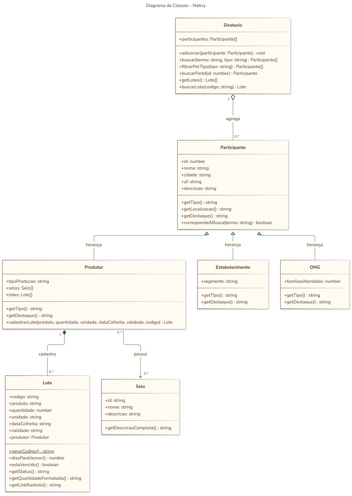

# Nativy - Agrotech (FIAP, Fase 6)

Site da Nativy, uma rede que conecta pequenos produtores rurais, estabelecimentos com excedente alimentar e ONGs de distribuicao para reduzir o desperdicio de alimentos.

Projeto desenvolvido para o PBL Agrotech da FIAP. Na Fase 5 o site foi reconstruido em React e ganhou o Diretorio. Na Fase 6 o site inteiro passou a usar os conceitos do React (rotas, componentes controlados pelo estado e hooks) e ganhou uma nova funcionalidade: a Rastreabilidade com QR Code.

## Links

- Deploy (Vercel): https://fiap-agrotech-eight.vercel.app
- Pitch Video (Fase 6): (colocar o link do video novo aqui)
- Pitch Video (Fase 5): https://www.youtube.com/watch?v=FfcAUoAydCg

## Nova funcionalidade: Rastreabilidade com QR Code

- O produtor cadastra um lote com produto, quantidade, data da colheita e validade
- Cada lote ganha um codigo unico e um QR Code
- Quem escaneia o QR Code abre a pagina do lote, com a validade e quem produziu
- Os lotes cadastrados ficam salvos no navegador (localStorage)
- O link do QR Code leva os dados do lote, entao abre em qualquer celular

## O que mudou da Fase 5 para a Fase 6

- Paginas com React Router, cada uma com a sua URL
- Modais e menu com react-bootstrap, controlados pelo estado do React (sem o JS do Bootstrap)
- Diretorio usando as classes do projeto, com filtro por tipo e selos
- Validacoes dos formularios em um arquivo so e mensagem de sucesso depois de enviar
- Pagina 404 e vercel.json para as rotas funcionarem no deploy
- Home com novas secoes e o video do pitch

## Diagrama de classes



As classes ficam em `src/models` e o codigo do diagrama (Mermaid) esta em `docs/diagrama-classes.md`.

- Heranca: Produtor, Estabelecimento e ONG herdam de Participante
- Composicao: o Produtor cadastra e guarda os seus Lotes
- Associacao: o Produtor possui Selos
- Agregacao: o Diretorio reune os Participantes

## Tecnologias

- React 19
- React Router
- React Bootstrap e Bootstrap 5
- qrcode.react
- Vite

## Estrutura

```
src/
  App.jsx            rotas do site e controle dos modais
  components/        Navbar, Footer e os modais de Criar conta, Entrar e Fale conosco
  pages/             Home, Diretorio, Rastreabilidade, Rastreio, Sobre e 404
  models/            classes do projeto (Participante, Produtor, Lote, Selo...)
  data/              participantes, lotes e selos de exemplo
  utils/             validacoes e datas
  styles/            variaveis de cor
  index.css          estilos gerais
docs/                diagrama de classes
```

## Como rodar

```
npm install
npm run dev
```

Para gerar a versao de producao:

```
npm run build
```
