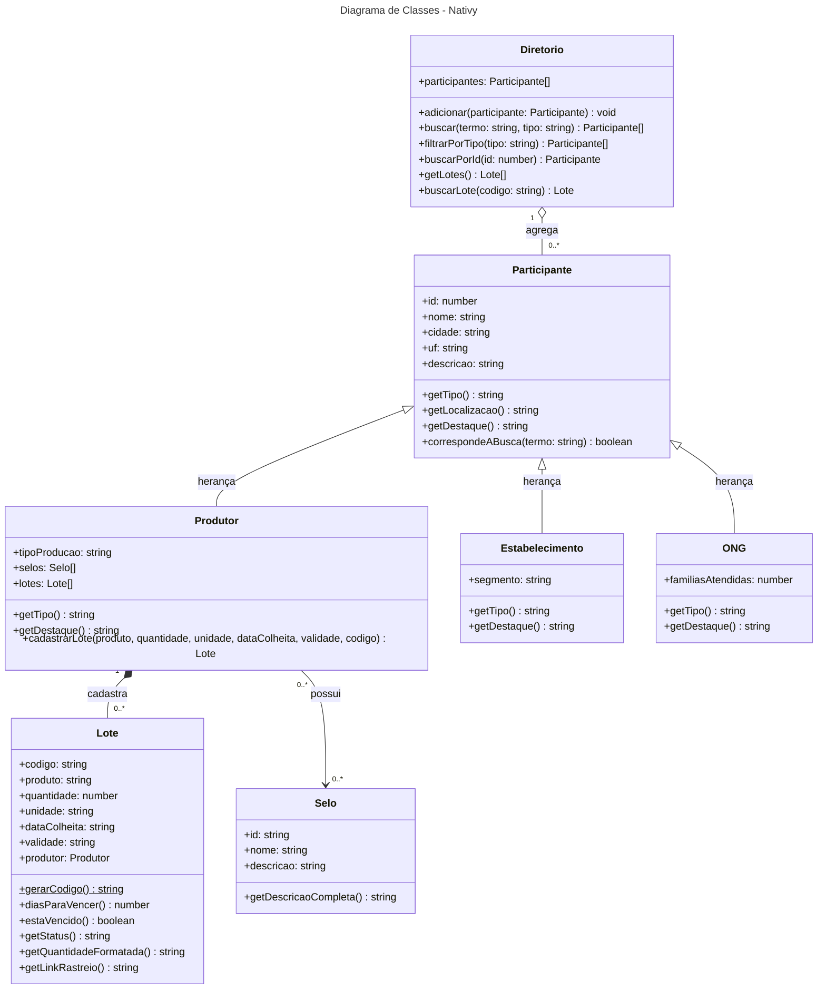

# Diagrama de Classes - Nativy (Fase 6)

Feito com Mermaid. As classes ficam em `src/models`.

## Relacionamentos

- **Herança:** `Produtor`, `Estabelecimento` e `ONG` herdam de `Participante` e sobrescrevem `getTipo()` e `getDestaque()`.
- **Composição:** o `Produtor` cria e guarda os seus `Lote`s pelo método `cadastrarLote()`. O lote não existe sem um produtor.
- **Associação:** o `Produtor` possui `Selo`s de identificação. O mesmo selo pode estar em vários produtores.
- **Agregação:** o `Diretorio` reúne os participantes da rede para buscar e filtrar.
